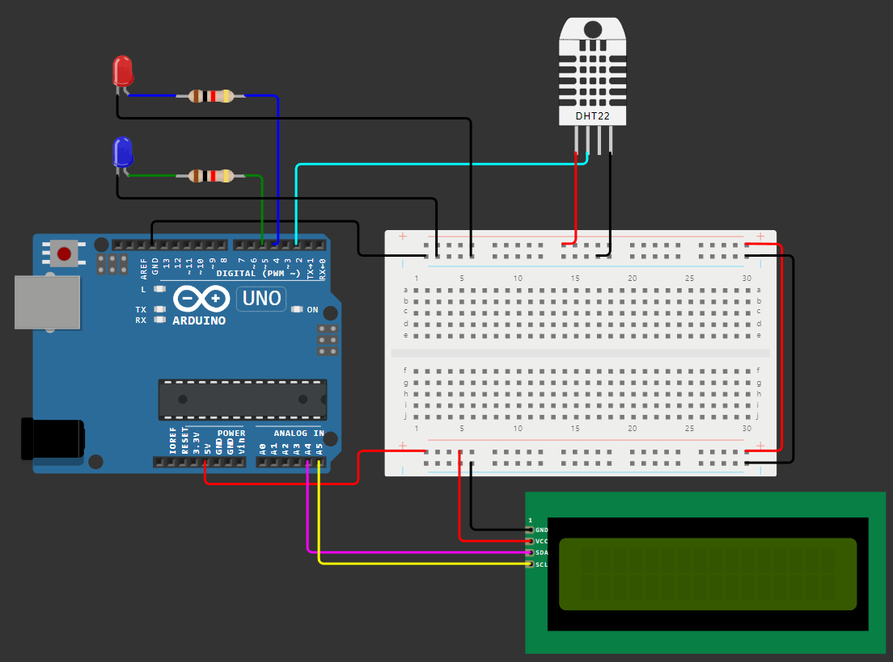

# Arduino Plant Environment Control 🌱

Este projeto é um sistema automatizado de controle de temperatura e umidade projetado para plantas, utilizando um Arduino UNO e sensores, utilizou-se LEDs para a simulação de interação com dispositivos externos, como irrigadores.

O objetivo principal é criar um ambiente otimizado para o monitoramento de plantio, monitorando e ajustando automaticamente os parâmetros críticos de temperatura e umidade.

---

## 💧 Considerações do Processo de Evapotranspiração

- A temperatura mínima estipulada deve ser com base na cultura desejada para o planejamento de plantio em função de geadas.

- As umidades relativas, mínima e máxima, foram definidas com base na curva característica de retenção de água no solo, onde os valores recomendados para o fator de segurança de disponibilidade de água no solo para a manutenção encontra-se na tabela a seguir, sendo fator o mínimo o Ponto de Murcha Permanente e o máximo o Ponto de Saturação.

| GRUPOS DE CULTURAS   | FATOR f   |
| :------------------- | :-------- |
| Olerícolas           | 0,2 a 0,4 |
| Frutas e Forrageiras | 0,3 a 0,5 |
| Grãos e Algodão      | 0,4 a 0,6 |

---

## ⚙️ Funcionalidades

- **Medição de temperatura e umidade:** Utiliza o sensor DHT22.
- **Controle automático:** Indicador de alerta de temperatura baixa e acionamento de irrigadores com base nos limites configurados.
- **Interface com LCD:** Exibição em tempo real dos dados coletados e mensagens de alerta.
- **Configurações personalizáveis:** Ajuste de limites diretamente no código.

---

## 🖥️ Componentes Necessários

- **1x Arduino UNO (ou equivalente).**
- **1x Sensor DHT22 (temperatura e umidade).**
- **1x Display LCD 16x2 com módulo I2C.**
- **2x LEDs (cores distintas).**
- **Protoboard e jumpers.**

---

## 📷 Esquema de Conexões

Confira o diagrama abaixo para realizar as conexões corretamente:



---


---

## 🚀 Configuração e Uso

Este projeto foi desenvolvido na plataforma [Wokwi](https://wokwi.com/), você pode conferir o projeto original a partir do link:
[Projeto no Wokwi](https://wokwi.com/projects/416584557862640641)

### 1. Instale as Bibliotecas Necessárias
Certifique-se de ter as seguintes bibliotecas no Arduino IDE:
- [DHT Sensor Library](https://github.com/adafruit/DHT-sensor-library)
- [LiquidCrystal_I2C](https://github.com/johnrickman/LiquidCrystal_I2C)

### 2. Carregue o Código no Arduino
1. Clone este repositório:
   ```bash
   git clone https://github.com/seu-usuario/Arduino-Plant-Environment-Control.git

### 3. Simulando o projeto
Para simular este projeto, instale a extensão [Wokwi Simulator](https://marketplace.visualstudio.com/items?itemName=Wokwi.wokwi-vscode) para o VS Code.
Abra o diretório do projeto, aperte F1 e selecione "Wokwi: Start Simulator".
